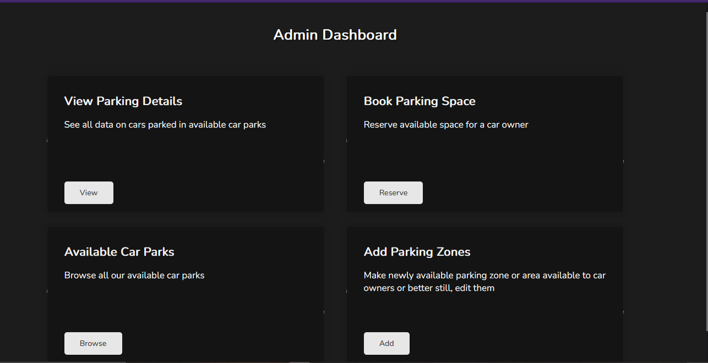

## A Conceptual Car Parking System

### This a conceptual car-parking system web app built by Group 0, to demonstrate the concept of a real-world database model; schema, entities...

### Screenshot

Live link to website => https://noahweasley.github.io/Car-Parking-System/Frontend/

Shortened Link => https://bit.ly/car-parking-system
